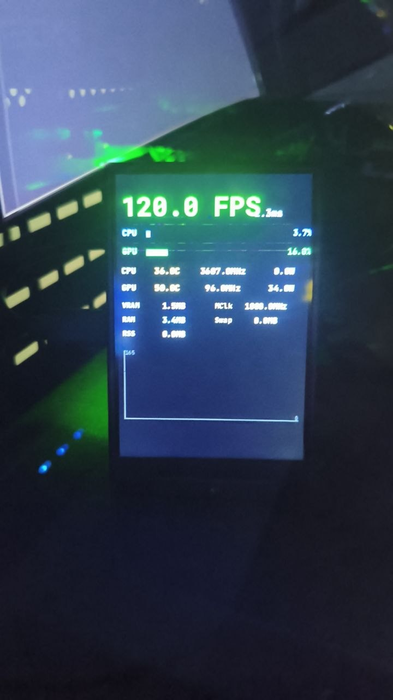

# MangoHud Turing Theme

Exibe dados do MangoHud (FPS, temperaturas, uso de CPU/GPU) na **Turing Smart Screen** enquanto você joga.



## Funciona com

- [turing-smart-screen-python](https://github.com/mathoudebine/turing-smart-screen-python)
- [MangoHud](https://github.com/flightlessmango/MangoHud) (CSV logging)
- Display 3.5" (320x480) em modo retrato

## Pré-requisitos

- **MangoHud** já instalado ([github.com/flightlessmango/MangoHud](https://github.com/flightlessmango/MangoHud))
- **turing-smart-screen-python** instalado e funcionando
- Python 3 com as dependências do turing-smart-screen-python instaladas

## Instalação

```bash
git clone <seu-repo>
cd mangohud-turing-theme
./install.sh
```

O instalador:
1. Detecta automaticamente o `turing-smart-screen-python` no diretório atual ou `~/turing-smart-screen-python`
2. Instala o tema `MangoHudTheme`
3. Adiciona os sensores customizados ao `library/sensors/sensors_custom.py`
4. Configura o MangoHud (`~/.config/MangoHud/MangoHud.conf`) com `output_folder` e `autostart_log=5`
5. Instala os scripts de atalho (`theme-mangohud.sh`, `theme-desktop.sh`)

## Uso

### Ativar o tema MangoHud

```bash
cd ~/turing-smart-screen-python
./theme-mangohud.sh
```

### Voltar ao tema desktop

```bash
cd ~/turing-smart-screen-python
./theme-desktop.sh
```

### Mudar tema manualmente

Edite `config.yaml`:
```yaml
THEME: MangoHudTheme    # para jogos
THEME: 3.5inchTheme2     # para desktop
```

## Dados exibidos

| Item | Descrição | Sensor |
|------|-----------|--------|
| **FPS** | Quadros por segundo | `MangoHudFPS` |
| **FT** | Frametime (ms) | `MangoHudFrametime` |
| **CPU Load** | Uso da CPU (%) | `MangoHudCpuLoad` |
| **GPU Load** | Uso da GPU (%) | `MangoHudGpuLoad` |
| **CPU Temp** | Temperatura da CPU | `MangoHudCpuTemp` |
| **GPU Temp** | Temperatura da GPU | `MangoHudGpuTemp` |
| **CPU Power** | Consumo da CPU (W) | `MangoHudCpuPower` |
| **GPU Power** | Consumo da GPU (W) | `MangoHudGpuPower` |
| **CPU MHz** | Frequência da CPU | `MangoHudCpuMhz` |
| **GPU Core** | Frequência do núcleo GPU | `MangoHudGpuCoreClock` |
| **GPU Mem** | Frequência da memória GPU | `MangoHudGpuMemClock` |
| **RAM** | Memória RAM usada (MB) | `MangoHudRamUsed` |
| **VRAM** | Memória de vídeo usada (MB) | `MangoHudVramUsed` |
| **Swap** | Swap usado (MB) | `MangoHudSwapUsed` |
| **RSS** | Memória do processo (MB) | `MangoHudProcessRss` |

## Atalhos Niri

Adicione no `~/.config/niri/config.kdl`:

```kdl
Mod+Z { spawn "/caminho/para/turing-smart-screen-python/theme-mangohud.fish"; }
Mod+X { spawn "/caminho/para/turing-smart-screen-python/theme-desktop.fish"; }
```

## Adicionar/remover dados no tema

Edite `res/themes/MangoHudTheme/theme.yaml` e adicione ou remova classes `MangoHud*` na seção `STATS.CUSTOM`.

## Personalização

Cada sensor aceita 4 tipos de widget:

- **TEXT** — valor formatado (ex: "120.5 FPS")
- **GRAPH** — barra de progresso horizontal (ex: uso %)
- **RADIAL** — barra circular (não usado neste tema)
- **LINE_GRAPH** — gráfico de linha histórico (ex: FPS)

## Como funciona

1. MangoHud salva logs CSV em `~/.config/MangoHud/mangologs/`
2. O sensor `_MangoHudCache` lê o arquivo mais recente a cada 0.5s
3. As classes `MangoHud*` extraem valores específicos do CSV
4. O tema exibe os dados na tela Turing através do sistema de custom sensors
